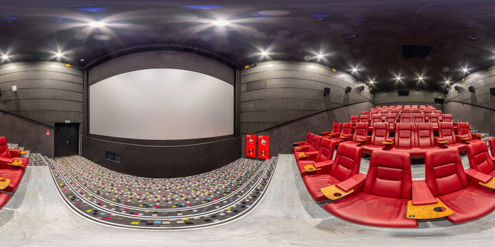

# 🎬 Movie Ticket Booking System

A full-stack web application for booking movie tickets online. This project is containerized with Docker and can be deployed locally or on Render.com.

---

## 📁 Repository Access

To access and use this project:

1. **Clone the repository**:
   ```bash
   git clone https://github.com/Vishnukranthreddy/Movieticketbooking.git
   cd Movieticketbooking


## 🌟 Features

- 🎟️ Book movie tickets online
- 📍 Select theaters and show timings
- 🧾 Manage bookings with confirmation
- 🖼️ **Panoramic Theater View** – Explore the seating layout using interactive panoramas for an immersive seat selection experience

## 🛠️ Tech Stack

- Frontend: HTML, CSS, JavaScript
- Backend: PHP 
- Database: MySQL
- Containerization: Docker, Docker Compose
- Deployment: Render.com


### 🎥 Panorama View
[](https://vishnukranthreddy.github.io/panoramas/)

> Click the image above to experience the interactive panoramic theater view.
